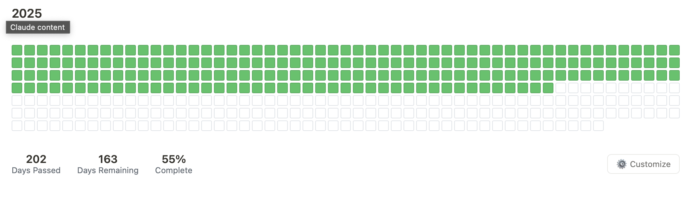

# Year Progress Tracker

A beautiful, GitHub-style contribution grid that tracks your progress through the year. Perfect for embedding in Notion pages to visualize how much of the year has passed.

## Features

- **Visual Progress**: GitHub-style grid showing filled squares for each day that has passed
- **Auto-updating**: Automatically fills in new squares each day
- **Customizable Colors**: Change filled square and border colors to match your aesthetic
- **Persistent Settings**: Your color preferences are saved and restored between sessions
- **Responsive Design**: Works perfectly on desktop and mobile
- **Notion-optimized**: Designed specifically for embedding in Notion pages
- **Clean Stats**: Shows days passed, days remaining, and completion percentage

## Quick Start

1. Copy the entire HTML code from the artifact
2. In Notion, create an "Embed" block
3. Paste the HTML code
4. The tracker will automatically display the current year's progress

## Customization

Click the "⚙️ Customize" button to access settings:

- **Filled Color**: Color for days that have passed (default: green)
- **Border Color**: Border color for upcoming days (default: light gray)

Your color choices are automatically saved and will persist even after restarting your computer.

## How It Works

The tracker automatically:
- Calculates the current day of the year
- Fills squares for all days that have passed
- Updates daily at midnight to show new progress
- Displays real-time statistics

## Browser Compatibility

Works in all modern browsers:
- Chrome/Chromium
- Firefox
- Safari
- Edge

## Technical Details

- **No external dependencies**: Pure HTML, CSS, and JavaScript
- **Lightweight**: Single file, minimal code
- **Privacy-friendly**: All data stored locally in your browser
- **Year-aware**: Automatically handles leap years

## Annual Updates

Each year, update the title from "2025" to the current year. The day calculations automatically adjust for leap years.

## Notion Integration Tips

- Use full-width embed blocks for best visual impact
- The tracker automatically spans the full width of your Notion page
- Colors can be customized to match your Notion theme
- Works in both light and dark Notion modes

## Troubleshooting

**Tracker not updating daily?**
- The page needs to be refreshed daily for updates
- Consider bookmarking the Notion page for easy access

**Colors not saving?**
- Ensure your browser allows localStorage
- Settings are device-specific (won't sync across devices)

**Grid appears cut off?**
- Use a full-width embed block in Notion
- Ensure your browser zoom is at 100%

## Future Enhancements

Potential features for future versions:
- Dark mode toggle
- Goal milestone markers
- Previous year viewing
- Export/import settings
- Custom year selection

## License

Free to use and modify for personal and commercial projects.

## Support

For issues or feature requests, the code is self-contained and can be easily modified to suit your needs.